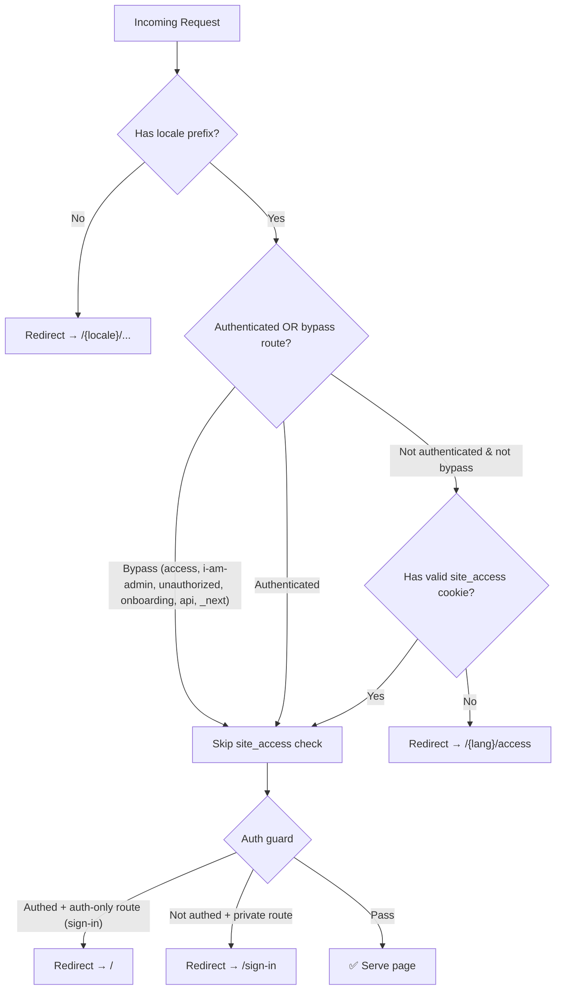
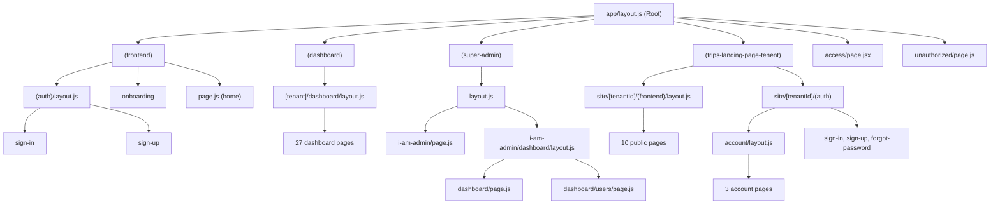

# 🗺️ TripWheel Frontend — Complete Sitemap

> **Generated**: 2026-03-29  
> **Framework**: Next.js 16 (App Router)  
> **Locales**: [en](file:///Users/pixelvega/devripon/tripwheel/Island-tours-clean-code/clean-frontend/auth.js#34-55), `nl` — all page routes are prefixed with `/{lang}/`  
> **Middleware**: [proxy.js](file:///Users/pixelvega/devripon/tripwheel/Island-tours-clean-code/clean-frontend/proxy.js)

---

## Route Legend

| Symbol | Meaning |
|--------|---------|
| 🔓 | Public route (no auth required) |
| 🔐 | Private route (auth required) |
| 🛡️ | Super admin only |
| 🌐 | Tenant site (public-facing) |
| ⚡ | API route (server-side only) |
| 🔑 | Access key gated |

---

## 1. 🔓 Public / Frontend Routes

> Layout: [app/[lang]/(frontend)/(auth)/layout.js](file:///Users/pixelvega/devripon/tripwheel/Island-tours-clean-code/clean-frontend/app/[lang]/(frontend)/(auth)/layout.js)

| Route | File | Notes |
|-------|------|-------|
| `/{lang}` | [(frontend)/page.js](file:///Users/pixelvega/devripon/tripwheel/Island-tours-clean-code/clean-frontend/app/[lang]/(frontend)/page.js) | 🔓 Landing / home page |
| `/{lang}/sign-in` | [(auth)/sign-in/page.js](file:///Users/pixelvega/devripon/tripwheel/Island-tours-clean-code/clean-frontend/app/[lang]/(frontend)/(auth)/sign-in/page.js) | 🔓 User login |
| `/{lang}/sign-in/forgot-password` | [(auth)/sign-in/forgot-password/page.js](file:///Users/pixelvega/devripon/tripwheel/Island-tours-clean-code/clean-frontend/app/[lang]/(frontend)/(auth)/sign-in/forgot-password/page.js) | 🔓 Password reset |
| `/{lang}/sign-up` | [(auth)/sign-up/page.js](file:///Users/pixelvega/devripon/tripwheel/Island-tours-clean-code/clean-frontend/app/[lang]/(frontend)/(auth)/sign-up/page.js) | 🔓 User registration |
| `/{lang}/onboarding` | [(frontend)/onboarding/page.js](file:///Users/pixelvega/devripon/tripwheel/Island-tours-clean-code/clean-frontend/app/[lang]/(frontend)/onboarding/page.js) | 🔐 Post-registration onboarding |

---

## 2. 🔑 Utility Pages

| Route | File | Notes |
|-------|------|-------|
| `/{lang}/access` | [access/page.jsx](file:///Users/pixelvega/devripon/tripwheel/Island-tours-clean-code/clean-frontend/app/[lang]/access/page.jsx) | 🔑 Site access key gate |
| `/{lang}/unauthorized` | [unauthorized/page.js](file:///Users/pixelvega/devripon/tripwheel/Island-tours-clean-code/clean-frontend/app/[lang]/unauthorized/page.js) | 🔓 Unauthorized API key error |

---

## 3. 🔐 Dashboard Routes (B2B Tenant)

> **Pattern**: `/{lang}/{tenant}/dashboard/...`  
> **Layout**: [dashboard/layout.js](file:///Users/pixelvega/devripon/tripwheel/Island-tours-clean-code/clean-frontend/app/[lang]/(dashboard)/[tenant]/dashboard/layout.js)  
> **Auth**: All routes require authentication

### Core

| Route | File | Notes |
|-------|------|-------|
| `/{lang}/{tenant}/dashboard` | [dashboard/page.js](file:///Users/pixelvega/devripon/tripwheel/Island-tours-clean-code/clean-frontend/app/[lang]/(dashboard)/[tenant]/dashboard/page.js) | 🔐 Main dashboard overview |

### Content Management (Blogs)

| Route | File | Notes |
|-------|------|-------|
| `/{lang}/{tenant}/dashboard/blogs` | [(blogs)/blogs/page.js](file:///Users/pixelvega/devripon/tripwheel/Island-tours-clean-code/clean-frontend/app/[lang]/(dashboard)/[tenant]/dashboard/(blogs)/blogs/page.js) | 🔐 Blog list |
| `/{lang}/{tenant}/dashboard/create-blog` | [(blogs)/create-blog/page.js](file:///Users/pixelvega/devripon/tripwheel/Island-tours-clean-code/clean-frontend/app/[lang]/(dashboard)/[tenant]/dashboard/(blogs)/create-blog/page.js) | 🔐 Create new blog |

### Trip Management

| Route | File | Notes |
|-------|------|-------|
| `/{lang}/{tenant}/dashboard/activities` | [(trips)/activities/page.js](file:///Users/pixelvega/devripon/tripwheel/Island-tours-clean-code/clean-frontend/app/[lang]/(dashboard)/[tenant]/dashboard/(trips)/activities/page.js) | 🔐 Activities list |
| `/{lang}/{tenant}/dashboard/all-affiliate-trips` | [(trips)/all-affiliate-trips/page.js](file:///Users/pixelvega/devripon/tripwheel/Island-tours-clean-code/clean-frontend/app/[lang]/(dashboard)/[tenant]/dashboard/(trips)/all-affiliate-trips/page.js) | 🔐 Affiliate trips |
| `/{lang}/{tenant}/dashboard/categories` | [(trips)/categories/page.js](file:///Users/pixelvega/devripon/tripwheel/Island-tours-clean-code/clean-frontend/app/[lang]/(dashboard)/[tenant]/dashboard/(trips)/categories/page.js) | 🔐 Trip categories |
| `/{lang}/{tenant}/dashboard/create-affiliate-trips` | [(trips)/create-affiliate-trips/page.js](file:///Users/pixelvega/devripon/tripwheel/Island-tours-clean-code/clean-frontend/app/[lang]/(dashboard)/[tenant]/dashboard/(trips)/create-affiliate-trips/page.js) | 🔐 Create affiliate trip |
| `/{lang}/{tenant}/dashboard/destinations` | [(trips)/destinations/page.js](file:///Users/pixelvega/devripon/tripwheel/Island-tours-clean-code/clean-frontend/app/[lang]/(dashboard)/[tenant]/dashboard/(trips)/destinations/page.js) | 🔐 Destinations list |
| `/{lang}/{tenant}/dashboard/pickups-drops` | [(trips)/pickups-drops/page.js](file:///Users/pixelvega/devripon/tripwheel/Island-tours-clean-code/clean-frontend/app/[lang]/(dashboard)/[tenant]/dashboard/(trips)/pickups-drops/page.js) | 🔐 Pickup/drop points |

### CRM & Business

| Route | File | Notes |
|-------|------|-------|
| `/{lang}/{tenant}/dashboard/bookings` | [bookings/page.js](file:///Users/pixelvega/devripon/tripwheel/Island-tours-clean-code/clean-frontend/app/[lang]/(dashboard)/[tenant]/dashboard/bookings/page.js) | 🔐 All bookings |
| `/{lang}/{tenant}/dashboard/customers` | [customers/page.js](file:///Users/pixelvega/devripon/tripwheel/Island-tours-clean-code/clean-frontend/app/[lang]/(dashboard)/[tenant]/dashboard/customers/page.js) | 🔐 Customer management |
| `/{lang}/{tenant}/dashboard/enquires` | [enquires/page.js](file:///Users/pixelvega/devripon/tripwheel/Island-tours-clean-code/clean-frontend/app/[lang]/(dashboard)/[tenant]/dashboard/enquires/page.js) | 🔐 Enquiry inbox |
| `/{lang}/{tenant}/dashboard/leads` | [leads/page.js](file:///Users/pixelvega/devripon/tripwheel/Island-tours-clean-code/clean-frontend/app/[lang]/(dashboard)/[tenant]/dashboard/leads/page.js) | 🔐 Lead management |
| `/{lang}/{tenant}/dashboard/payments` | [payments/page.js](file:///Users/pixelvega/devripon/tripwheel/Island-tours-clean-code/clean-frontend/app/[lang]/(dashboard)/[tenant]/dashboard/payments/page.js) | 🔐 Payment overview |
| `/{lang}/{tenant}/dashboard/reviews` | [reviews/page.js](file:///Users/pixelvega/devripon/tripwheel/Island-tours-clean-code/clean-frontend/app/[lang]/(dashboard)/[tenant]/dashboard/reviews/page.js) | 🔐 Review management |
| `/{lang}/{tenant}/dashboard/tour-operators` | [tour-operators/page.js](file:///Users/pixelvega/devripon/tripwheel/Island-tours-clean-code/clean-frontend/app/[lang]/(dashboard)/[tenant]/dashboard/tour-operators/page.js) | 🔐 Tour operator management |

### User Self-Service (Tenant Member)

| Route | File | Notes |
|-------|------|-------|
| `/{lang}/{tenant}/dashboard/my-bookings` | [my-bookings/page.js](file:///Users/pixelvega/devripon/tripwheel/Island-tours-clean-code/clean-frontend/app/[lang]/(dashboard)/[tenant]/dashboard/my-bookings/page.js) | 🔐 User's own bookings |
| `/{lang}/{tenant}/dashboard/my-payments` | [my-payments/page.js](file:///Users/pixelvega/devripon/tripwheel/Island-tours-clean-code/clean-frontend/app/[lang]/(dashboard)/[tenant]/dashboard/my-payments/page.js) | 🔐 User's own payments |

### Media & AI Tools

| Route | File | Notes |
|-------|------|-------|
| `/{lang}/{tenant}/dashboard/media` | [media/page.js](file:///Users/pixelvega/devripon/tripwheel/Island-tours-clean-code/clean-frontend/app/[lang]/(dashboard)/[tenant]/dashboard/media/page.js) | 🔐 Media library |
| `/{lang}/{tenant}/dashboard/ai-image` | [ai-image/page.jsx](file:///Users/pixelvega/devripon/tripwheel/Island-tours-clean-code/clean-frontend/app/[lang]/(dashboard)/[tenant]/dashboard/ai-image/page.jsx) | 🔐 AI image generator |

### Settings

| Route | File | Notes |
|-------|------|-------|
| `/{lang}/{tenant}/dashboard/automation` | [(settings)/automation/page.js](file:///Users/pixelvega/devripon/tripwheel/Island-tours-clean-code/clean-frontend/app/[lang]/(dashboard)/[tenant]/dashboard/(settings)/automation/page.js) | 🔐 Automation settings |
| `/{lang}/{tenant}/dashboard/contacts-billings` | [(settings)/contacts-billings/page.js](file:///Users/pixelvega/devripon/tripwheel/Island-tours-clean-code/clean-frontend/app/[lang]/(dashboard)/[tenant]/dashboard/(settings)/contacts-billings/page.js) | 🔐 Billing & contacts |
| `/{lang}/{tenant}/dashboard/credentials` | [(settings)/credentials/page.js](file:///Users/pixelvega/devripon/tripwheel/Island-tours-clean-code/clean-frontend/app/[lang]/(dashboard)/[tenant]/dashboard/(settings)/credentials/page.js) | 🔐 API keys / credentials |
| `/{lang}/{tenant}/dashboard/payment-methods` | [(settings)/payment-methods/page.js](file:///Users/pixelvega/devripon/tripwheel/Island-tours-clean-code/clean-frontend/app/[lang]/(dashboard)/[tenant]/dashboard/(settings)/payment-methods/page.js) | 🔐 Payment methods config |
| `/{lang}/{tenant}/dashboard/site-settings` | [(settings)/site-settings/page.js](file:///Users/pixelvega/devripon/tripwheel/Island-tours-clean-code/clean-frontend/app/[lang]/(dashboard)/[tenant]/dashboard/(settings)/site-settings/page.js) | 🔐 General site settings |

### User Management

| Route | File | Notes |
|-------|------|-------|
| `/{lang}/{tenant}/dashboard/all-user` | [(user)/all-user/page.js](file:///Users/pixelvega/devripon/tripwheel/Island-tours-clean-code/clean-frontend/app/[lang]/(dashboard)/[tenant]/dashboard/(user)/all-user/page.js) | 🔐 All users list |
| `/{lang}/{tenant}/dashboard/profile` | [(user)/profile/page.js](file:///Users/pixelvega/devripon/tripwheel/Island-tours-clean-code/clean-frontend/app/[lang]/(dashboard)/[tenant]/dashboard/(user)/profile/page.js) | 🔐 User profile |

---

## 4. 🛡️ Super Admin Routes

> **Pattern**: `/{lang}/i-am-admin/...`  
> **Layout**: [super-admin/layout.js](file:///Users/pixelvega/devripon/tripwheel/Island-tours-clean-code/clean-frontend/app/[lang]/(super-admin)/layout.js) → [dashboard/layout.js](file:///Users/pixelvega/devripon/tripwheel/Island-tours-clean-code/clean-frontend/app/[lang]/(super-admin)/i-am-admin/dashboard/layout.js)

| Route | File | Notes |
|-------|------|-------|
| `/{lang}/i-am-admin` | [i-am-admin/page.js](file:///Users/pixelvega/devripon/tripwheel/Island-tours-clean-code/clean-frontend/app/[lang]/(super-admin)/i-am-admin/page.js) | 🛡️ Super admin login |
| `/{lang}/i-am-admin/dashboard` | [i-am-admin/dashboard/page.js](file:///Users/pixelvega/devripon/tripwheel/Island-tours-clean-code/clean-frontend/app/[lang]/(super-admin)/i-am-admin/dashboard/page.js) | 🛡️ Admin dashboard |
| `/{lang}/i-am-admin/dashboard/users` | [i-am-admin/dashboard/users/page.js](file:///Users/pixelvega/devripon/tripwheel/Island-tours-clean-code/clean-frontend/app/[lang]/(super-admin)/i-am-admin/dashboard/users/page.js) | 🛡️ User management |

---

## 5. 🌐 Tenant Public Site (B2C Customer-Facing)

> **Pattern**: `/{lang}/site/{tenantId}/...`  
> **Layouts**: [frontend/layout.js](file:///Users/pixelvega/devripon/tripwheel/Island-tours-clean-code/clean-frontend/app/[lang]/(trips-landing-page-tenent)/site/[tenantId]/(frontend)/layout.js), [account/layout.js](file:///Users/pixelvega/devripon/tripwheel/Island-tours-clean-code/clean-frontend/app/[lang]/(trips-landing-page-tenent)/site/[tenantId]/(auth)/account/layout.js)

### Public Pages

| Route | File | Notes |
|-------|------|-------|
| `/{lang}/site/{tenantId}` | [(frontend)/page.js](file:///Users/pixelvega/devripon/tripwheel/Island-tours-clean-code/clean-frontend/app/[lang]/(trips-landing-page-tenent)/site/[tenantId]/(frontend)/page.js) | 🌐 Tenant homepage |
| `/{lang}/site/{tenantId}/trips` | [(frontend)/trips/page.js](file:///Users/pixelvega/devripon/tripwheel/Island-tours-clean-code/clean-frontend/app/[lang]/(trips-landing-page-tenent)/site/[tenantId]/(frontend)/trips/page.js) | 🌐 Trips listing |
| `/{lang}/site/{tenantId}/trips/{slug}` | [(frontend)/trips/[slug]/page.js](file:///Users/pixelvega/devripon/tripwheel/Island-tours-clean-code/clean-frontend/app/[lang]/(trips-landing-page-tenent)/site/[tenantId]/(frontend)/trips/[slug]/page.js) | 🌐 Trip detail page |
| `/{lang}/site/{tenantId}/trips/{slug}/payment/success` | [payment/success/page.js](file:///Users/pixelvega/devripon/tripwheel/Island-tours-clean-code/clean-frontend/app/[lang]/(trips-landing-page-tenent)/site/[tenantId]/(frontend)/trips/[slug]/payment/success/page.js) | 🌐 Payment success |
| `/{lang}/site/{tenantId}/activities` | [(frontend)/activities/page.js](file:///Users/pixelvega/devripon/tripwheel/Island-tours-clean-code/clean-frontend/app/[lang]/(trips-landing-page-tenent)/site/[tenantId]/(frontend)/activities/page.js) | 🌐 Activities listing |
| `/{lang}/site/{tenantId}/activities/{id}` | [(frontend)/activities/[id]/page.js](file:///Users/pixelvega/devripon/tripwheel/Island-tours-clean-code/clean-frontend/app/[lang]/(trips-landing-page-tenent)/site/[tenantId]/(frontend)/activities/[id]/page.js) | 🌐 Activity detail |
| `/{lang}/site/{tenantId}/destinations/{slug}` | [(frontend)/destinations/[slug]/page.js](file:///Users/pixelvega/devripon/tripwheel/Island-tours-clean-code/clean-frontend/app/[lang]/(trips-landing-page-tenent)/site/[tenantId]/(frontend)/destinations/[slug]/page.js) | 🌐 Destination detail |
| `/{lang}/site/{tenantId}/blogs` | [(frontend)/blogs/page.js](file:///Users/pixelvega/devripon/tripwheel/Island-tours-clean-code/clean-frontend/app/[lang]/(trips-landing-page-tenent)/site/[tenantId]/(frontend)/blogs/page.js) | 🌐 Blog listing |
| `/{lang}/site/{tenantId}/blogs/{slug}` | [(frontend)/blogs/[slug]/page.js](file:///Users/pixelvega/devripon/tripwheel/Island-tours-clean-code/clean-frontend/app/[lang]/(trips-landing-page-tenent)/site/[tenantId]/(frontend)/blogs/[slug]/page.js) | 🌐 Blog post |
| `/{lang}/site/{tenantId}/contact` | [(frontend)/contact/page.js](file:///Users/pixelvega/devripon/tripwheel/Island-tours-clean-code/clean-frontend/app/[lang]/(trips-landing-page-tenent)/site/[tenantId]/(frontend)/contact/page.js) | 🌐 Contact page |

### Customer Auth & Account

| Route | File | Notes |
|-------|------|-------|
| `/{lang}/site/{tenantId}/sign-in` | [(auth)/sign-in/page.js](file:///Users/pixelvega/devripon/tripwheel/Island-tours-clean-code/clean-frontend/app/[lang]/(trips-landing-page-tenent)/site/[tenantId]/(auth)/sign-in/page.js) | 🌐 Customer login |
| `/{lang}/site/{tenantId}/sign-up` | [(auth)/sign-up/page.js](file:///Users/pixelvega/devripon/tripwheel/Island-tours-clean-code/clean-frontend/app/[lang]/(trips-landing-page-tenent)/site/[tenantId]/(auth)/sign-up/page.js) | 🌐 Customer registration |
| `/{lang}/site/{tenantId}/forgot-password` | [(auth)/forgot-password/page.js](file:///Users/pixelvega/devripon/tripwheel/Island-tours-clean-code/clean-frontend/app/[lang]/(trips-landing-page-tenent)/site/[tenantId]/(auth)/forgot-password/page.js) | 🌐 Customer password reset |
| `/{lang}/site/{tenantId}/account` | [(auth)/account/page.js](file:///Users/pixelvega/devripon/tripwheel/Island-tours-clean-code/clean-frontend/app/[lang]/(trips-landing-page-tenent)/site/[tenantId]/(auth)/account/page.js) | 🔐 Customer account |
| `/{lang}/site/{tenantId}/account/my-bookings` | [(auth)/account/my-bookings/page.js](file:///Users/pixelvega/devripon/tripwheel/Island-tours-clean-code/clean-frontend/app/[lang]/(trips-landing-page-tenent)/site/[tenantId]/(auth)/account/my-bookings/page.js) | 🔐 Customer bookings |
| `/{lang}/site/{tenantId}/account/my-payments` | [(auth)/account/my-payments/page.js](file:///Users/pixelvega/devripon/tripwheel/Island-tours-clean-code/clean-frontend/app/[lang]/(trips-landing-page-tenent)/site/[tenantId]/(auth)/account/my-payments/page.js) | 🔐 Customer payments |

---

## 6. ⚡ API Routes

| Route | File | Method | Notes |
|-------|------|--------|-------|
| `/api/auth/[...nextauth]` | [route.js](file:///Users/pixelvega/devripon/tripwheel/Island-tours-clean-code/clean-frontend/app/api/auth/[...nextauth]/route.js) | GET, POST | NextAuth handler |
| `/api/auth/wp-login` | [route.js](file:///Users/pixelvega/devripon/tripwheel/Island-tours-clean-code/clean-frontend/app/api/auth/wp-login/route.js) | POST, OPTIONS | WordPress API key login |
| `/api/chat` | [route.js](file:///Users/pixelvega/devripon/tripwheel/Island-tours-clean-code/clean-frontend/app/api/chat/route.js) | — | AI chat endpoint |
| `/api/generate-image` | [route.js](file:///Users/pixelvega/devripon/tripwheel/Island-tours-clean-code/clean-frontend/app/api/generate-image/route.js) | — | Image generation |
| `/api/generate-image-gemini` | [route.js](file:///Users/pixelvega/devripon/tripwheel/Island-tours-clean-code/clean-frontend/app/api/generate-image-gemini/route.js) | — | Gemini image gen |
| `/api/generate-image-vertex` | [route.js](file:///Users/pixelvega/devripon/tripwheel/Island-tours-clean-code/clean-frontend/app/api/generate-image-vertex/route.js) | — | Vertex AI image gen |
| `/api/uploads/image` | [route.js](file:///Users/pixelvega/devripon/tripwheel/Island-tours-clean-code/clean-frontend/app/api/uploads/image/route.js) | — | Single image upload |
| `/api/uploads/image/multiple` | [route.js](file:///Users/pixelvega/devripon/tripwheel/Island-tours-clean-code/clean-frontend/app/api/uploads/image/multiple/route.js) | — | Batch image upload |
| `/api/uploads/profile-photo` | [route.js](file:///Users/pixelvega/devripon/tripwheel/Island-tours-clean-code/clean-frontend/app/api/uploads/profile-photo/route.js) | — | Profile photo upload |

---

## 7. Middleware & Route Guards

> Defined in [proxy.js](file:///Users/pixelvega/devripon/tripwheel/Island-tours-clean-code/clean-frontend/proxy.js) and [route-list.js](file:///Users/pixelvega/devripon/tripwheel/Island-tours-clean-code/clean-frontend/lib/route-list.js)

### Guard Layers (in order of execution)

### Site Access Bypass Routes

| Route Pattern | Reason |
|---------------|--------|
| `/access` | Access key entry page itself |
| `/i-am-admin` | Super admin routes |
| `/unauthorized` | Error page for invalid API keys |
| `/onboarding` | Post-registration onboarding |
| `/api/` | API endpoints |
| `/_next/` | Next.js internals |

### Route Classification

| Category | Routes |
|----------|--------|
| **Public** | `/`, `/sign-in`, `/sign-up`, `/plan`, `/site`, `/website-builder`, `/detailed-itinerary`, `/team-management`, `/grow-revenue`, `/reports-analytics`, `/payment-gateways`, `/partner`, `/news-updates`, `/tutorials`, `/support`, `/documentation`, `/feature-request` |
| **Private** | `/onboarding`, `/dashboard` |
| **Blocked when logged in** | *(currently none — commented out)* |

---

## 8. Layout Hierarchy

---

## Route Count Summary

| Section | Count |
|---------|-------|
| Public/Frontend pages | 5 |
| Utility pages | 2 |
| Dashboard pages | 27 |
| Super Admin pages | 3 |
| Tenant site pages (public) | 10 |
| Tenant site pages (customer auth) | 6 |
| API routes | 9 |
| **Total** | **62** |
